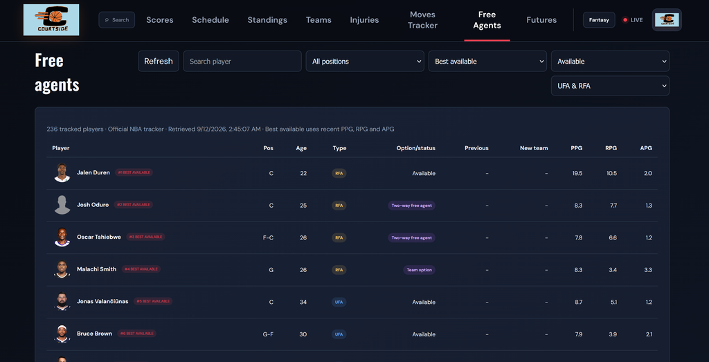
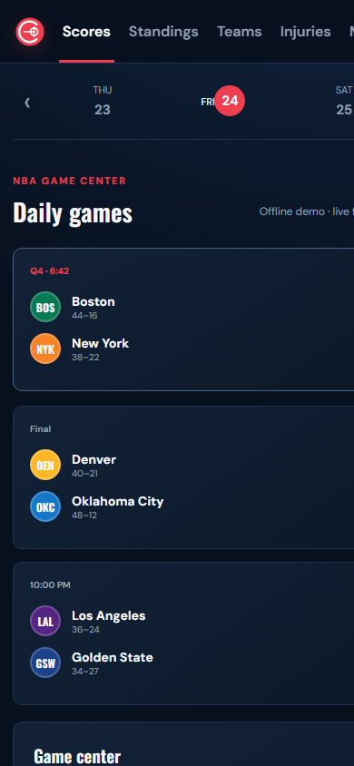

# Courtside

**NBA scores, game details, and trade news in one place.**

I built Courtside because I kept checking ESPN to keep up with games. I wanted an easier way to follow scores and roster moves from one dashboard, with a small pinned scoreboard I could keep nearby while doing other things.

Built with **JavaScript, HTML, CSS, and Node.js**, with deployment support for **Vercel**.



## What you can do

- **Follow games:** scores refresh every 20 seconds, with box scores, team stats, and play-by-play.
- **Keep a score close:** pin a game to either bottom corner. In supported browsers, float it above other desktop windows while the app tab stays open.
- **Catch up on the league news:** browse trades, signings, injuries, and ESPN news updates.
- **Explore teams and players:** view standings, schedules, rosters, and player profiles.
- **Understand roster moves:** check contracts, payrolls, salary-caps, and free-agent status.

Team logos are bundled locally. Theme, favorite-team preferences, and the pinned-game selection are saved in your browser.

## Engineering highlights

Courtside connects a browser interface to a Node.js API that normalizes data from multiple basketball sources.

- **Consistent data shapes:** provider adapters handle upstream responses so the interface can work with a common format.
- **Resilient score updates:** caching and fallback data help when feeds are unavailable. Saved scoreboard data is labeled offline, and older requests cannot overwrite a newer date selection.
- **Independent score tracking:** the pinned widget refreshes its chosen game even when you browse another scoreboard date.
- **Responsive interaction:** desktop and mobile layouts, keyboard controls, and labeled dialogs support different ways of using the app.
- **Automated checks:** tests cover provider normalization, finance invariants, HTTP validation, security headers, accessibility guardrails, score-request ordering, and bundled logos.

```text
Browser interface --> Node.js API --> Basketball data sources
                         |
                Normalization + caching
```

<details>
<summary>View the mobile layout</summary>



</details>

## Run locally

Requires Node.js 18 or newer.

```sh
git clone https://github.com/FarhnChy/Courtside-nba-stat-tracking.git
cd Courtside-nba-stat-tracking
npm install
npm run dev
```

Open [localhost:3000](http://localhost:3000).

```sh
npm test             # Run automated checks
npm run audit:data   # Check manual snapshots for stale data
```

On Windows PowerShell, use `npm.cmd` if script execution settings prevent `npm` from running.

<details>
<summary>Project structure and deployment</summary>

| Location | Purpose |
| --- | --- |
| `public/` | Browser interface, styles, pinned scoreboard, and team logos |
| `server.js` | Local server and API routes |
| `lib/` and `providers/` | Data adapters and normalization |
| `data/` | Fallback snapshots and curated roster context |
| `api/` and `vercel.json` | Vercel deployment configuration |
| `test/` | Automated checks |

To deploy, import the repository into Vercel using the **Other** framework preset. The project includes static assets and a Node Function for API requests. No API keys are required by the current configuration.

</details>

## Data and project status

Scores and league updates use ESPN public site feeds. Free-agent and cap information draws on NBA.com, NBA Communications, Basketball Reference, and SalarySwish. Repository snapshots provide additional fallback context. These integrations are unofficial, and availability or freshness can vary by source.

The core project focuses on scores and league tracking. Prediction, awards-race, shot-chart, and win-probability views are **demonstrations, not validated forecasts**. Fantasy currently saves local league details; it does not sync with ESPN or Yahoo accounts. Desktop floating requires Document Picture-in-Picture support and HTTPS or localhost; the corner widget is available without that feature.

Next steps include broader browser testing, fantasy-provider integration, and backtested prediction models.

---

Courtside is an independent portfolio project, not affiliated with or endorsed by ESPN or the NBA. Team names and logos belong to their respective owners.
