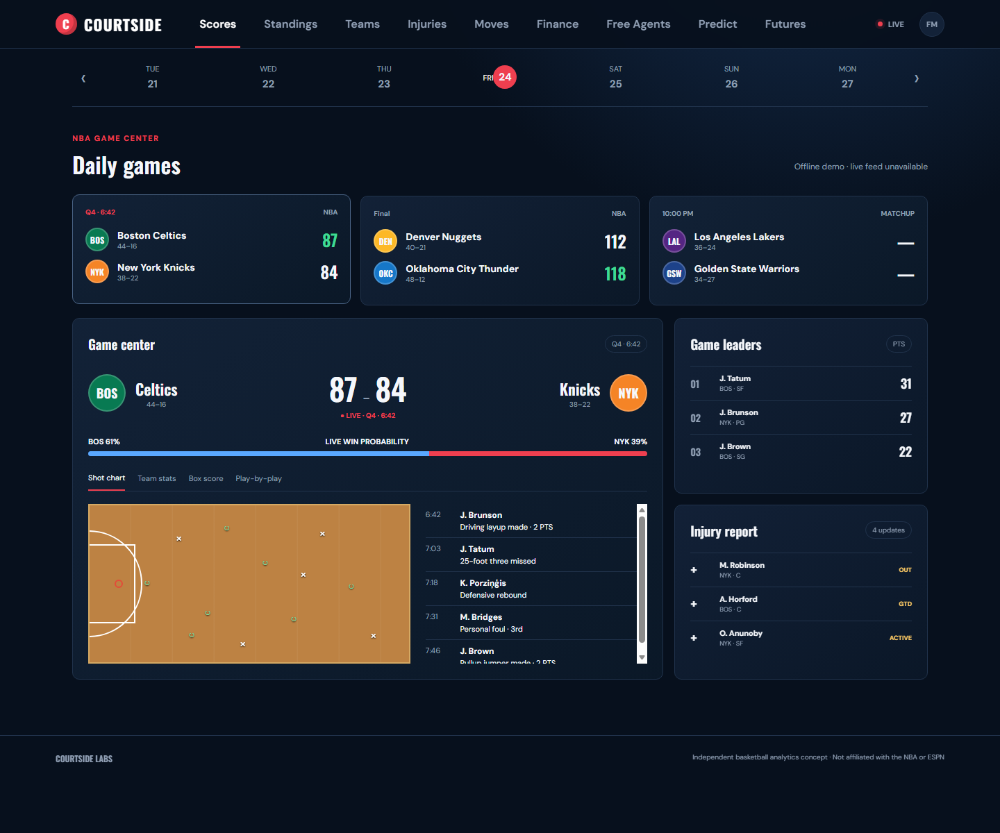

# Courtside

Courtside is a responsive NBA game center and roster-economics dashboard. It combines live scores and full game details with standings, rosters, injuries, transactions, contracts, free agency, and salary-cap context in one original interface.

Vercel deployment ready · Demo video coming soon



## Current features

- Daily NBA scoreboard with 20-second live refresh and offline fallback
- Released NBA schedule hub with date, team, status filters, and calendar game-count markers
- Full player box scores, team statistics, period scoring, and play-by-play
- East and West standings with playoff and play-in indicators
- All 30 teams, searchable rosters, coaches, and injury availability
- Clickable player profiles with headshots, season statistics, honors, and news
- Recent transactions with team and move-type filters
- Official cap thresholds, payroll rankings, and multi-year contracts
- Player/team contract options, free agents, and projected cap holds
- Awards Race Center with MVP/award boards and East/West No. 1 seed model views
- Shareable screen routes, responsive navigation, and keyboard interaction

The prediction, futures, shot-chart, and win-probability surfaces currently demonstrate the intended product experience. Calibrated historical models and live shot-coordinate animation are roadmap work and are not presented as production forecasts.

## Architecture

```text
Browser UI
   |
   v
Browser / Vercel CDN  --> Node serverless API + short-lived normalized cache
   |
   +--> ESPN site feeds: games, standings, teams, players, injuries, moves
   +--> NBA sources: free agency and official cap thresholds
   +--> Basketball Reference / SalarySwish: contracts and cap holds
```

The browser consumes only Courtside's stable local JSON shapes. Provider-specific parsing, validation, and caching remain in the API so upstream response changes do not spread through the interface. On Vercel, CDN revalidation refreshes scores after 15 seconds; injuries, transactions, and ESPN/Shams news after 60 seconds; schedules after two minutes; and financial/free-agent pages after 15 minutes. Visitor requests trigger refresh automatically, so routine data updates require no code edit or redeploy.

## Run locally

Requires Node.js 18 or newer.

```powershell
npm.cmd install
npm.cmd run dev
```

Open [http://localhost:3000](http://localhost:3000).

```powershell
npm.cmd test
npm.cmd run audit:data
```

The test suite checks the app shell, provider normalization, finance invariants, HTTP validation, security headers, static accessibility guardrails, and static serving. The data audit reports stale manual snapshots without blocking local development unless run with `node scripts/audit-data.js --strict`.

## API routes

- `GET /api/scoreboard?date=YYYY-MM-DD`
- `GET /api/schedule?start=YYYY-MM-DD&days=7`
- `GET /api/games/:eventId`
- `GET /api/standings`
- `GET /api/teams`
- `GET /api/teams/:teamId/roster`
- `GET /api/players/:playerId`
- `GET /api/injuries`
- `GET /api/transactions`
- `GET /api/free-agents`
- `GET /api/finance/cap`
- `GET /api/finance/payrolls`
- `GET /api/finance/teams/:abbr/contracts`
- `GET /api/finance/teams/:abbr/cap-holds`
- `GET /api/health`

## Data references

- [hoopR](https://github.com/sportsdataverse/hoopR) informed the ESPN adapter structure.
- [NBA.com schedule and key dates](https://www.nba.com/schedule) provide released schedule context for the calendar and upcoming games.
- [NBA Communications](https://pr.nba.com/) supplies official salary-cap thresholds.
- [NBA Free Agent Tracker](https://www.nba.com/players/free-agent-tracker) supplies free-agent status and movement data.
- [Basketball Reference contracts](https://www.basketball-reference.com/contracts/) supplies cached payroll and contract summaries.
- [SalarySwish](https://www.salaryswish.com/) supplies projected cap holds.
- [nba_data](https://github.com/llimllib/nba_data) and [awesome-nba-data](https://github.com/JovaniPink/awesome-nba-data) are being evaluated for historical modeling inputs.

The ESPN site endpoints used by this prototype are unofficial and may change. Financial figures can also change during the offseason, so relevant screens expose source and retrieval context.

## Deploy to Vercel

The repository includes `vercel.json` and a catch-all Node Function for the existing `/api/*` routes. No secrets are currently required.

1. Import this GitHub repository at [vercel.com/new](https://vercel.com/new).
2. Leave Framework Preset as **Other**, Root Directory as the repository root, and the build/output fields at their defaults.
3. Deploy. Vercel serves `public/` and routes `/api/*` through `api/index.js`.
4. In the Vercel project, open **Settings → Domains** to attach a custom domain if wanted.

The old Render blueprint has been removed. Vercel Hobby cron jobs are limited to once daily, so Courtside uses automatic on-request revalidation instead of a constant background process. This gives active visitors fresh data for free without storing scraped copies. Truly always-on ingestion would require an external scheduler and persistent database.

## Live and fallback sources

- ESPN public site APIs with ESPN CDN failover: live scores, schedules, box scores, standings, team rosters, injuries, transactions, player pages, NBA news, and ESPN articles attributed to Shams Charania.
- NBA.com: free-agent tracker and roster reconciliation; NBA Communications for cap thresholds.
- Basketball Reference: team payroll and contract tables.
- SalarySwish: projected cap holds.
- Repository snapshots in `data/`: fallback/offseason rows used when a live source is missing or for manually verified historical context.

Courtside does not scrape X/Twitter directly. X access is brittle and generally requires a paid API; Shams updates currently enter through ESPN's NBA news feed, where his reporting is published, and retain their source links. These public endpoints are unofficial integrations and can change, so review provider terms before commercial use.

## Roadmap

1. Public deployment and cross-device release testing
2. Expanded player and team detail pages
3. Focused Fantasy Lab with configurable scoring and saved lineups
4. Backtested playoff and championship probability models
5. Live win probability and shot-by-shot animation

## Disclaimer

Courtside is an independent educational portfolio project and is not affiliated with or endorsed by ESPN or the NBA. Provider terms and data licenses should be reviewed before any commercial distribution.
